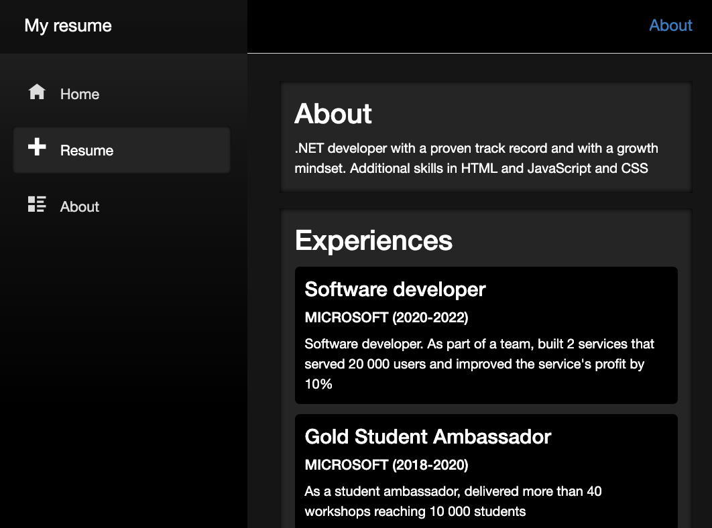

#  A resume in Blazor

This tech demo in Blazor renders a resume on route `/resume`. It relies on a JSON file to render the resume.

## Styling

Components rely mostly on their own styling, "<Component>.razor.css" with a few exceptions in `wwwroot/css/app.css`.

## Components

- `Resume`, a component you can navigate to via `/resume`.
- `Skill`, presentation component rendering a skill.
- `Experience`, presentation component rendering an experience.
- `Education`, presentation component rendering an education.

## Data

The idea is for this app to use an API. Currently, it relies on static data, a JSON file placed in `sample-data/resume.json`.

The data is a JSON file and looks like the following hierarchy:

```json
{
 "about": "string",
 "experiences" : [],
 "educations": [],
 "skills" : []
}
```

## Run

```console
dotnet run
```

## DEMO


